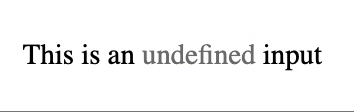

# React WrapInput 🌮
> an `<input />` but that horizontally wrap the content 


```jsx
return (
    <p>
      This is an
      {' '}
      <WrapInput placeholder="undefined" />
      {' '}
      input based on a native &lt;input&gt; element
    </p>
)
```

## Dev
Install peer dependencies for Storybook
```sh
npm install --no-save react-dom webpack
npm run storybook
```
